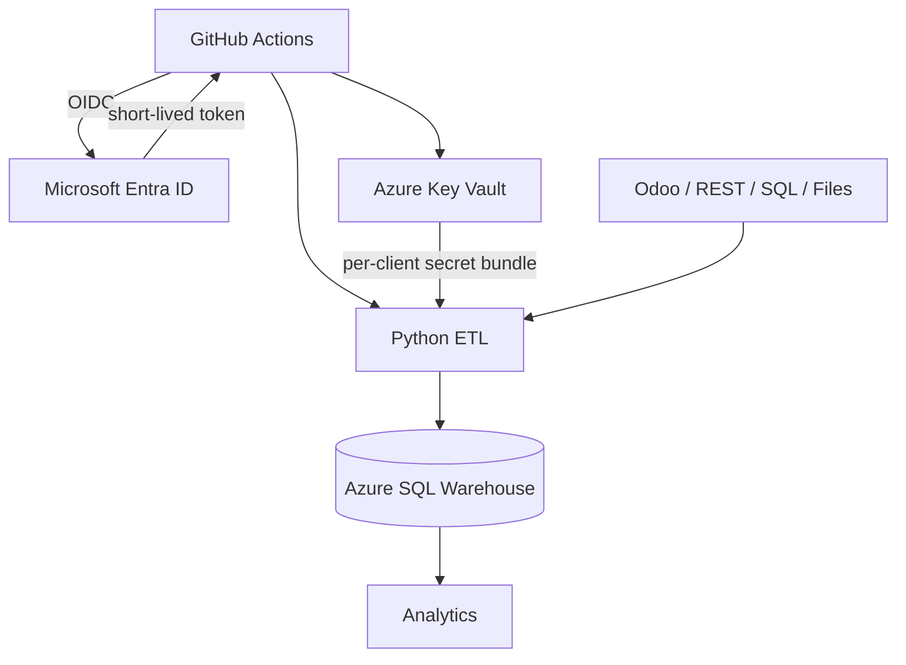
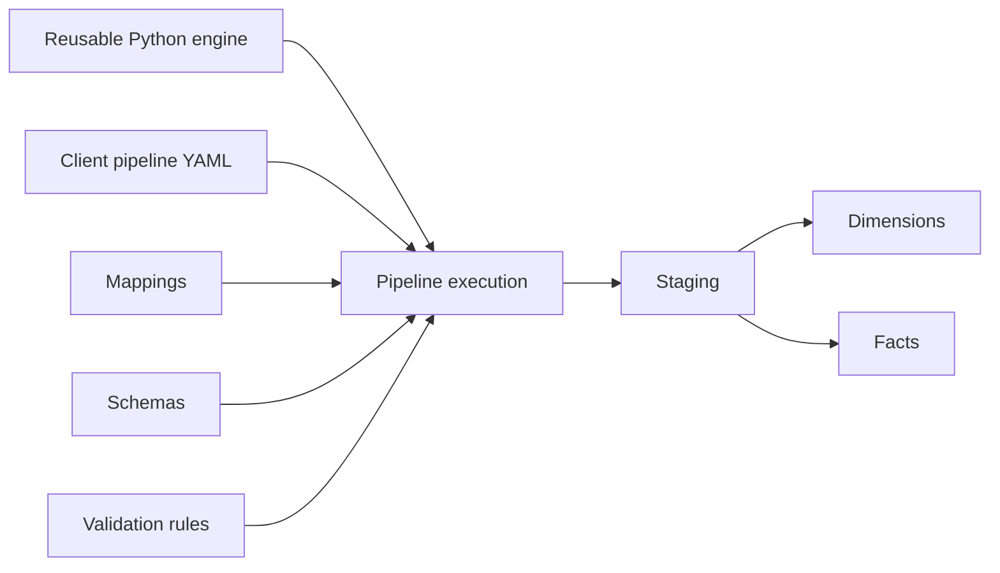
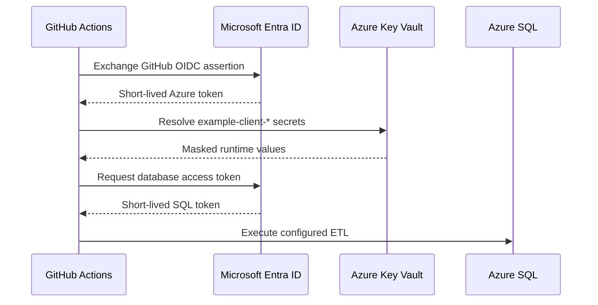

# System diagrams

## System context

```mermaid
flowchart TB
    GH[GitHub Actions] -->|OIDC| ID[Microsoft Entra ID]
    ID -->|short-lived token| GH
    GH --> KV[Azure Key Vault]
    GH --> ETL[Python ETL]
    KV -->|per-client secret bundle| ETL
    SRC[Odoo / REST / SQL / Files] --> ETL
    ETL --> DW[(Azure SQL Warehouse)]
    DW --> BI[Analytics]
```

## Metadata resolution

```mermaid
flowchart LR
    BASE[Reusable Python engine] --> RUN[Pipeline execution]
    CFG[Client pipeline YAML] --> RUN
    MAP[Mappings] --> RUN
    SCH[Schemas] --> RUN
    RULE[Validation rules] --> RUN
    RUN --> STG[Staging]
    STG --> DIM[Dimensions]
    STG --> FACT[Facts]
```

## Security boundary

```mermaid
sequenceDiagram
    participant Workflow as GitHub Actions
    participant Entra as Microsoft Entra ID
    participant Vault as Azure Key Vault
    participant SQL as Azure SQL

    Workflow->>Entra: Exchange GitHub OIDC assertion
    Entra-->>Workflow: Short-lived Azure token
    Workflow->>Vault: Resolve example-client-* secrets
    Vault-->>Workflow: Masked runtime values
    Workflow->>Entra: Request database access token
    Entra-->>Workflow: Short-lived SQL token
    Workflow->>SQL: Execute configured ETL
```
